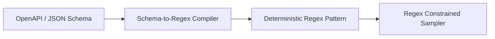

# genpark-json-schema-to-regex-converter-skill

Compiles structured JSON Schemas into equivalent regular expressions for logit-constrained decoding.

## Architecture

## Features
- **Enum Support**: Exact branch constraints for enum fields.
- **Pure Python**: 100% standard library.
